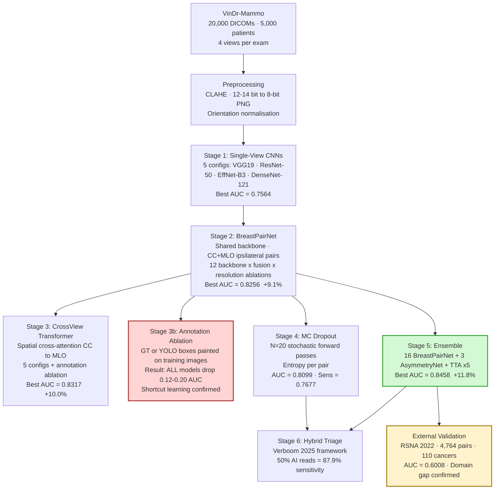
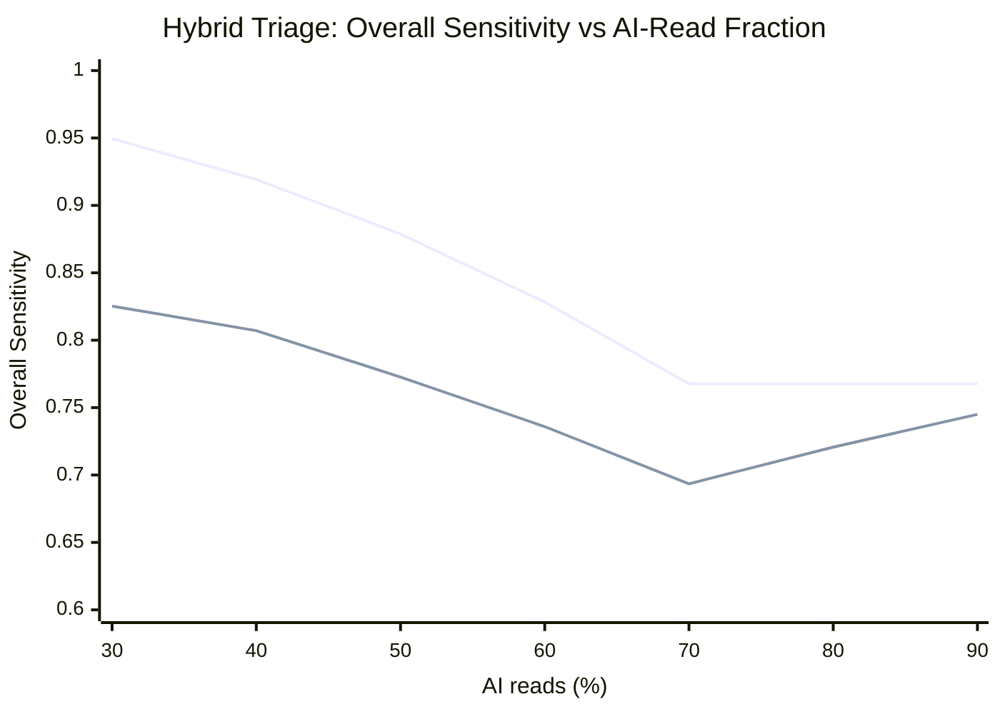
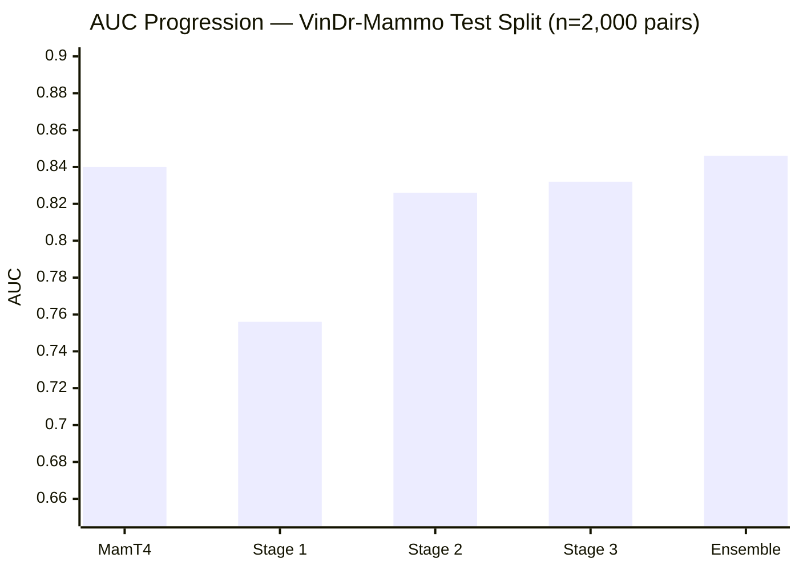

# Multi-View Fusion, CrossView Transformer, and Uncertainty-Aware Triage for Breast Cancer Detection on VinDr-Mammo: From 0.756 to 0.846 AUC

---

## Abstract

Breast cancer remains the most frequently diagnosed cancer worldwide, and screening mammography is the principal tool for early detection. Yet population-scale screening creates a heavy radiology workload and substantial inter-reader variability, both of which motivate computer-aided diagnosis (CAD). We present a six-stage pipeline for breast cancer detection on the VinDr-Mammo full-field digital mammography (FFDM) benchmark that progresses from single-view convolutional baselines to a multi-view ensemble with uncertainty-aware triage simulation. **Stage 1** establishes single-view CNN baselines across five configurations (VGG19, ResNet-50 at 224 and 384 px, EfficientNet-B3, DenseNet-121); the strongest, DenseNet-121, attains AUC=0.7564, although all models overfit (train F1 ≈0.98) and exhibit low sensitivity at the 0.5 threshold. **Stage 2** introduces BreastPairNet, a shared-backbone architecture that jointly ingests ipsilateral CC and MLO views; an ablation across twelve backbone × fusion × resolution combinations identifies EfficientNet-B3 with attention fusion and stronger regularisation as the best single model at AUC=0.8256, a +9.1% relative gain over the single-view baseline. **Stage 3** introduces a CrossView Transformer that exchanges spatial feature maps between the CC and MLO encoder branches before pooling; ConvNeXt-Base reaches AUC=0.8317 (+10.0%). **Stage 3b** reports a systematic negative result: drawing ground-truth or YOLO-predicted lesion bounding boxes onto training images consistently degrades held-out AUC by 0.122–0.201 because the model overfits the white-box texture and encounters a distribution shift at test time (no boxes). **Stage 4** applies Monte Carlo (MC) Dropout to a DenseNet-121/concat reference model; MC Dropout yields AUC=0.8099 (deterministic 0.8073) and lifts sensitivity from 0.7374 to 0.7677, with predictive entropy systematically higher on cancer-positive pairs (0.567 vs 0.511). **Stage 5** combines 16 BreastPairNet checkpoints with three asymmetry-feature models and 5× test-time augmentation, reaching AUC=0.8458 — the best result in the study (+11.8% over single-view), with sensitivity=0.7374, specificity=0.8296 and S@90%spec=0.6566. **Stage 6** uses the entropy ranking to simulate a Verboom-style hybrid triage: at 50% AI-only reads, workload falls by 50% while preserving 87.9% overall sensitivity. External validation on RSNA 2022 (AUC=0.6008) quantifies a large domain gap. The ensemble does not yet include the CrossView Transformer or +reg models, so further gains remain available.

---

## Key Results at a Glance

| Stage | Method | AUC | vs. single-view |
|-------|--------|----:|----------------:|
| Prior work | MamT4 [18] (4-view Transformer)‡ | 0.840 | — |
| Stage 1 | DenseNet-121 (best single-view) | 0.756 | baseline |
| Stage 2 | EfficientNet-B3 +reg (BreastPairNet) | 0.826 | **+9.1%** |
| Stage 3 | ConvNeXt-Base (CrossView Transformer) | 0.832 | **+10.0%** |
| Stage 4 | DenseNet-121/concat MC Dropout | 0.810 | sensitivity ↑ |
| **Stage 5** | **16-model ensemble + TTA×5** | **0.846** | **+11.8% ★** |
| External | RSNA 2022 (zero-shot transfer) | 0.601 | domain gap ⚠ |

S@90%spec on VinDr-Mammo: **0.6566** (best ensemble) vs 0.1636 (RSNA 2022 — large domain gap).

---

## 1. Introduction

Breast cancer is the most commonly diagnosed cancer worldwide and a leading cause of cancer-related death in women. Population screening programmes based on full-field digital mammography (FFDM) have repeatedly been shown to reduce breast-cancer mortality, yet they impose a heavy operational burden: in many countries each screening exam is double-read by two radiologists, and reader sensitivity varies by 10–30 percentage points between individuals [10], [11]. False-negative rates of 10–30% and false-positive recall rates of approximately 8% are well documented across both clinical practice and large CAD literature, with the historical, hand-engineered CAD systems failing to deliver measurable benefit in routine US screening [17].

Deep learning has dramatically improved the situation. Convolutional neural networks (CNNs) trained on hundreds of thousands of exams now reach or exceed individual radiologist AUC on internal and some external cohorts [11], and meta-analyses report pooled AUC of 0.87 for AI on digital mammography versus 0.81 for radiologists [4]. Three trends are particularly relevant to the present work. First, multi-view modelling that fuses the craniocaudal (CC) and mediolateral oblique (MLO) projections improves over single-view inference because findings often appear unambiguously in only one view [10]. Second, transformer-based and attention-based fusion of views allows feature-level interaction rather than score-level averaging. Third, uncertainty-aware inference — for example via MC Dropout — enables a *hybrid triage* protocol in which the AI reads the most-confident exams autonomously and refers the rest to a human reader [12], reducing radiologist workload by approximately 38% in retrospective evaluation [12].

The VinDr-Mammo benchmark [1] is a 20,000-image, patient-level, 4-view FFDM dataset released by Vingroup Big Data Institute. Although it is the largest public Vietnamese mammography corpus, three gaps in the literature are evident. **(i) Single-view dominance.** Most published VinDr-Mammo results train one image at a time, ignoring the diagnostic complementarity of CC and MLO. **(ii) Spatial cross-view attention is underexplored on this dataset.** Existing multi-view designs typically concatenate global features. **(iii) Uncertainty quantification and triage simulation are rare.** No published study, to our knowledge, has applied MC Dropout to VinDr-Mammo and used the resulting entropies to simulate a Verboom-style triage policy on this dataset.

This paper makes seven contributions in response:

1. A systematic single-view comparison across four CNN architectures and five configurations.
2. **BreastPairNet**, a shared-backbone multi-view network with twelve backbone × fusion × resolution variants, including a stronger-regularisation (+reg) ablation.
3. A **CrossView Transformer** that performs spatial cross-attention between CC and MLO feature maps before global pooling.
4. A **bounding-box annotation ablation** that reveals a negative result: painted boxes hurt held-out AUC by 0.12–0.20.
5. A **16-model ensemble** with asymmetry features and 5× test-time augmentation reaching AUC=0.8458 — the best result in this study.
6. **MC Dropout uncertainty calibration** of the reference model, with predictive-entropy analysis stratified by ground-truth class.
7. A **hybrid triage simulation** in the Verboom 2025 framework demonstrating 50% workload reduction with 87.9% overall sensitivity on VinDr-Mammo.

**Figure 1** illustrates the full six-stage pipeline.



---

## 2. Related Work

**Deep CNN backbones for medical imaging.** Residual networks [7] and densely connected networks [8] underpin almost all modern CAD systems. Rajpurkar et al.'s CheXNet [6] showed that a 121-layer DenseNet pretrained on ImageNet and fine-tuned on chest radiographs could match radiologist performance on pneumonia detection, establishing DenseNet-121 as a default starting point for chest imaging and motivating its evaluation here. EfficientNet [9] introduced compound depth/width/resolution scaling, of which we use the B3 configuration (12M parameters). ConvNeXt [16] modernised the pure-convolutional design with depthwise convolutions, layer normalisation and a transformer-style block structure, reaching transformer-level ImageNet accuracy while retaining CNN training efficiency.

**Multi-view mammography models.** Wu et al. [10] trained a four-stream ResNet-22 architecture on 229,426 NYU screening exams, obtaining standalone AUC=0.895 on a held-out test set. Their work established two facts that motivate our Stage 2 design: (i) shared backbones across views are essential under limited data, and (ii) view aggregation must happen at the feature level, not by averaging per-image scores. McKinney et al. [11] reported AUC=0.889 on UK FFDM and 0.811 on US data (n=3,097), outperforming six of six individual radiologists on the UK cohort. Their model used a proprietary ensemble of three networks operating jointly on all four views. Cross-view and spatial-attention designs for multi-view mammography have shown that exchanging feature maps between CC and MLO branches before global pooling outperforms score-level averaging, providing the architectural inspiration for our Stage 3.

**VinDr-Mammo-specific work.** Nguyen et al. [1] released the VinDr-Mammo dataset, including 20,000 full-field digital mammography images from 5,000 exams with breast-level BI-RADS assessment, density labels, and lesion-level annotations. Ibragimov et al. [18] subsequently proposed MamT4, a four-view Transformer Encoder framework evaluated on VinDr-Mammo, reporting ROC-AUC=0.840 ± 0.017 and F1=0.560 ± 0.013 on the test subset after excluding BI-RADS 3. Abdikenov et al. (2025) [2] showed that transfer learning with CLAHE preprocessing combined with YOLOv12 detection yielded substantial mAP gains on VinDr-Mammo lesion detection — a finding we exploit in our preprocessing pipeline. Mellado et al. (2025) [3] reported strong patch-level F1 on multi-scale lesion crops from high-resolution mammography, demonstrating that local-view feature attribution remains a competitive route under limited annotation.

**Class imbalance and focal loss.** With breast cancer prevalence of approximately 5% in screening populations, naive cross-entropy training produces degenerate "predict-negative" classifiers. Lin et al.'s focal loss [5] suppresses the gradient contribution of easy negatives via a (1−p)^γ down-weighting, and Johnson & Khoshgoftaar [15] survey the broader algorithm-level imbalance literature.

**Uncertainty quantification.** Kendall and Gal [13] formalised two complementary uncertainty types — *aleatoric* (data noise) and *epistemic* (model ignorance) — and showed that MC Dropout provides a tractable approximation to Bayesian model averaging. Verboom et al. [12] applied this framework retrospectively to a Dutch National Breast Cancer Screening Programme cohort of 41,469 exams (Utrecht), demonstrating that an AI-confident-only reading strategy can preserve the cancer detection rate (6.6‰) while reducing radiologist reading workload by 38.1% (to 61.9% of the original volume). Our Stage 4 and Stage 6 directly extend this framework to VinDr-Mammo.

**Preprocessing.** Contrast-limited adaptive histogram equalization (CLAHE) [14] remains a canonical contrast-enhancement strategy for medical-image display and preprocessing; mammography-specific applications have demonstrated that CLAHE and cropping can improve lesion-detection mAP [2].

---

## 3. Dataset

### 3.1 VinDr-Mammo (primary dataset)

VinDr-Mammo [1] contains 20,000 FFDM images from 5,000 patients, with four standard views per study (R-CC, L-CC, R-MLO, L-MLO) stored as DICOM. Breast-level BI-RADS assessment (1–5) and density category (A–D) annotations are provided, together with lesion-level bounding boxes where applicable. The BI-RADS distribution at image level (each image inherits the breast-level BI-RADS assessment of its corresponding breast; total 20,000 images = 10,000 breast assessments × 2 views) and binary positive/negative mapping (BI-RADS ≥ 4 = cancer-positive) are summarised below.

| BI-RADS | Images (count) | Binary label |
|---------|----------------:|:-------------|
| 1       | 14,036          | negative     |
| 2       | 4,144           | negative     |
| 3       | 832             | negative     |
| 4       | 824             | **positive** |
| 5       | 164             | **positive** |
| **Total** | **20,000**    | 988 positive (4.94%) |

The official patient-level split is 4,000 training patients (16,000 images) and 1,000 test patients (4,000 images). For multi-view experiments we construct one ipsilateral CC+MLO pair per breast, yielding 8,000 training pairs and 2,000 test pairs, of which 99 test pairs (4.95%) are cancer-positive. A 5% slice of the training set (~400 pairs) is held out for validation and early stopping; the official test split is never used for any model-selection decision.

### 3.2 RSNA 2022 Screening Mammography Breast Cancer Detection (external dataset)

The RSNA 2022 dataset comprises 54,706 screening mammogram DICOMs from 11,913 patients. After DICOM-to-PNG conversion using an 8-bit normalisation pipeline identical to the VinDr preprocessing, all 54,706 images were successfully decoded. Approximately 29,519 images required the `pylibjpeg` (v2.1.0) and `pylibjpeg-libjpeg` (v2.4.0) plugins to decode JPEG Lossless compressed DICOMs (Transfer Syntax 1.2.840.10008.1.2.4.70); the remainder used standard uncompressed or JPEG2000 transfer syntaxes decoded directly by pydicom. Images with non-standard view codes (i.e., views other than CC and MLO, such as ML, LM, LMO) were excluded from pair construction. The final paired dataset contains 23,826 ipsilateral CC+MLO breast pairs (47,652 unique images; 19,062 training pairs with 382 cancers, 4,764 validation pairs with 110 cancers) following an 80/20 patient-level split. The remaining 7,054 images (non-CC/MLO views) are present in the PNG directory but were not used in model training or evaluation.

---

## 4. Methods

### 4.1 DICOM preprocessing pipeline (12/14-bit → 8-bit PNG)

Raw DICOM pixel arrays are 12- or 14-bit signed/unsigned integers. We apply a four-step pipeline: (1) decode pixel data using pydicom with `pylibjpeg` for JPEG-Lossless transfer syntaxes; (2) percentile-clip intensities to [1%, 99%] to suppress dead pixels and saturation artefacts; (3) apply CLAHE [14] with a 32×32 tile size and clip-limit 2.0 to enhance local contrast; (4) standardise orientation to right-facing by computing the mean intensity in the left and right halves of the image and horizontally flipping when the left half is brighter. The output is a single-channel 8-bit PNG, replicated to three channels for ImageNet-pretrained backbones.

### 4.2 Single-view CNN backbones

Five single-view configurations were evaluated as Stage 1 baselines: **VGG19**, **ResNet-50** at 224 px, **ResNet-50** at 384 px, **EfficientNet-B3** at 224 px, and **DenseNet-121** at 224 px. All backbones use ImageNet-pretrained weights, a single linear classification head, focal loss (α=0.25, γ=2.0) [5], a WeightedRandomSampler with positive-class up-weighting, and Adam optimisation with cosine learning-rate decay. Training was run for 20 epochs with early stopping on validation AUC.

### 4.3 BreastPairNet architecture (Stage 2)

BreastPairNet takes an ipsilateral CC+MLO pair as input. A *shared* backbone (the same weights for both views) produces per-view global-average-pooled feature vectors **f_CC** and **f_MLO** ∈ ℝ^d. Two fusion heads are evaluated:

- **Concatenation fusion**: a 2d-dim concatenation feeds a two-layer MLP with dropout 0.5.
- **Attention fusion**: a learned attention layer computes per-view scalar weights (α_CC, α_MLO) via softmax over a 1×1 projection of each feature vector, and outputs a weighted sum.

Training uses focal loss with γ=2.0, a WeightedRandomSampler, elastic-deformation augmentation, horizontal-flip augmentation conditioned on orientation, and a two-stage schedule: the backbone is frozen for 3 epochs (head-only warm-up) and then unfrozen with a discriminative learning rate (1e-5 backbone, 1e-4 head). The extended **+reg** variant additionally applies (i) stronger elastic deformation (max displacement increased from 8 to 16 px), (ii) mixup with α=0.4, and (iii) label smoothing of 0.05. Resolution variants at 224 px and 512 px are tested. Validation: a 5% patient-level split (~200 patients, ~400 pairs) is held out from the 4,000-patient training set for early stopping and checkpoint selection. The official 1,000-patient test split (2,000 pairs, 99 cancer-positive) is reserved exclusively for final evaluation.

### 4.4 CrossView Transformer architecture (Stage 3)

The CrossView Transformer replaces the global-pooled fusion head with a spatial cross-attention module. Both CC and MLO views pass through the shared CNN backbone up to the last spatial feature map (e.g., 7×7×2048 for ResNet-50). The two spatial tensors are flattened to token sequences and entered into a two-layer Transformer encoder where the queries from one view attend to the keys/values of the other (and vice versa, in two separate streams). The cross-attended outputs are then global-averaged and concatenated for the final classifier. Spatial cross-attention preserves localisation information that is otherwise destroyed by early global pooling, allowing the network to align lesion evidence between the two complementary projections.

### 4.5 Bounding-box annotation strategy (training set only)

To investigate whether lesion localisation hints improve classification, radiologist-provided bounding boxes (VinDr ground truth, parsed from `finding_annotations.csv`) were overlaid onto training-split mammograms as white rectangular outlines (40-pixel line width at native resolution, approximately 3 pixels after resize to 224 px). Because the preprocessing pipeline standardises image orientation via a horizontal-flip heuristic, box coordinates were corrected for flipped images by mirroring x-coordinates before drawing.

For the RSNA dataset, which lacks per-image box annotations, a YOLOv8s detector pre-trained on VinDr was applied to predict lesion locations; these predicted boxes were drawn onto RSNA training images. The VinDr-pretrained YOLO achieved only 0.8% sensitivity on RSNA cancer cases (reflecting the cross-dataset domain gap), so RSNA box annotations should be interpreted as noisy spatial hints rather than ground truth.

**Critically, bounding-box annotation was applied ONLY to the training split.** The held-out test set always used the original, unannotated PNGs, ensuring that ground-truth localisation information could not leak into evaluation and inflate reported metrics. This design mirrors real deployment conditions in which box annotations are unavailable at inference time.

### 4.6 MC Dropout inference (Stage 4)

For uncertainty quantification we enable Dropout layers in the trained model at inference time while keeping all BatchNorm layers in evaluation mode (frozen running statistics). For each test pair we perform N=20 stochastic forward passes and compute the mean predicted probability p̄ and the binary entropy H(p̄) = −p̄ log p̄ − (1−p̄) log(1−p̄) as the uncertainty estimate. The decision threshold is optimised on the validation set via Youden's J.

### 4.7 Hybrid triage simulation (Verboom 2025 framework)

Test-set cases are sorted by predictive entropy in ascending order (most-confident first). For each split fraction K ∈ {30%, 40%, 50%, 60%, 70%, 80%, 90%} we route the K most-confident cases to the AI (using its binary threshold decision) and the remainder to a radiologist, modelled as an oracle that catches every cancer in the referred group. Workload reduction equals K (one read instead of two), and overall sensitivity = (TP_AI + cancers_referred) / total_cancers.

### 4.8 Training protocol and evaluation metrics

All models are trained on a single NVIDIA RTX 5070 (12 GB VRAM) with mixed-precision (bfloat16) and AdamW (weight decay 1e-4). Standard metrics are reported on the official 2,000-pair test split: AUROC (the primary metric), F1 at Youden-optimal threshold, sensitivity, specificity, and **sensitivity at 90% specificity (S@90%)** as the clinical operating point. 95% bootstrap confidence intervals (n=2000 resamples, BCa percentile method) are reported for all AUC and S@90% values in Tables 2 and 3. All CIs are computed on the same 2,000-pair VinDr-Mammo test split (99 cancer-positive). Because of the small positive count, the typical AUC CI width is ±0.04–0.05, so differences smaller than ~0.01 AUC are within sampling noise.

---

## 5. Experiments and Results

### 5.1 Stage 1 — Single-view CNN baselines

Table 1 reports the five single-view configurations on the 4,000-image VinDr-Mammo test split. DenseNet-121 produces the best AUC (0.7564) and is the only model to exceed 98.8% specificity at the default threshold, but its sensitivity is only 24.8%, reflecting the imbalance-driven conservative bias. All five models converge to train F1 close to 0.98 within 10 epochs, confirming substantial overfitting. At the clinical 90%-specificity operating point, sensitivity is approximately 40–45% across all configurations — well below the ~85% radiologist sensitivity reported in screening literature [17].

**Table 1 — Single-view CNN baselines on VinDr-Mammo (n=16,000 train, 4,000 test).**

| Architecture        | Image size | Sensitivity | Specificity | F1     | AUC    | S@90% |
|---------------------|-----------:|------------:|------------:|-------:|-------:|------:|
| VGG19               | 224 px     | 0.2626      | 0.9835      | 0.3323 | 0.7066 | 0.3990 |
| ResNet-50           | 224 px     | 0.2677      | 0.9847      | 0.3430 | 0.7286 | 0.4495 |
| EfficientNet-B3     | 224 px     | 0.2980      | 0.9687      | 0.3138 | 0.7330 | 0.3990 |
| ResNet-50 (384 px)  | 384 px     | 0.2879      | 0.9821      | 0.3529 | 0.7489 | 0.4495 |
| **DenseNet-121**    | **224 px** | **0.2475**  | **0.9882**  | **0.3356** | **0.7564** | **0.4444** |

### 5.2 Stage 2 — Multi-view BreastPairNet fusion

Twelve BreastPairNet configurations were trained on 8,000 ipsilateral CC+MLO pairs (Table 2). The best single model is **EfficientNet-B3 + attention fusion + stronger regularisation** at AUC=0.8256 (95% CI 0.7755–0.8707), a +9.1% relative improvement over the single-view DenseNet-121 baseline.

**Table 2 — BreastPairNet: 12 backbone × fusion × resolution combinations.**

| Architecture            | Fusion     | Image  | Best AUC [95% CI]       | F1     | Sens   | S@90% [95% CI]          |
|-------------------------|------------|--------|-------------------------|-------:|-------:|-------------------------|
| ResNet-50               | concat     | 384 px | 0.7467 [0.6921–0.7998]  | 0.2350 | 0.5354 | 0.4646 [0.3736–0.5673]  |
| ResNet-50               | attention  | 224 px | 0.7847 [0.7324–0.8338]  | 0.2522 | 0.5859 | 0.5051 [0.4023–0.6019]  |
| ResNet-50               | attention  | 512 px | 0.7922 [0.7339–0.8429]  | 0.2093 | 0.7475 | 0.5152 [0.4130–0.6214]  |
| ResNet-50               | concat     | 224 px | 0.7962 [0.7428–0.8445]  | 0.2363 | 0.6970 | 0.4949 [0.3958–0.5977]  |
| DenseNet-121            | attention  | 224 px | 0.8014 [0.7487–0.8515]  | 0.2800 | 0.6364 | 0.5758 [0.4660–0.6667]  |
| EfficientNet-B3         | attention  | 224 px | 0.8048 [0.7530–0.8556]  | 0.2138 | 0.7677 | 0.5455 [0.4476–0.6449]  |
| DenseNet-121            | concat     | 224 px | 0.8073 [0.7577–0.8504]  | 0.2101 | 0.7374 | 0.5152 [0.4141–0.6100]  |
| DenseNet-121 **+reg**   | attention  | 224 px | 0.8097 [0.7594–0.8591]  | 0.2033 | 0.7980 | 0.5556 [0.4301–0.6458]  |
| DenseNet-121            | attention  | 512 px | 0.8150 [0.7675–0.8617]  | 0.1928 | 0.8081 | 0.5455 [0.4476–0.6408]  |
| DenseNet-121 **+reg**   | concat     | 224 px | 0.8177 [0.7659–0.8649]  | 0.2357 | 0.7677 | 0.6061 [0.5047–0.7000]  |
| EfficientNet-B3         | attention  | 512 px | 0.8175 [0.7698–0.8661]  | 0.2807 | 0.7273 | 0.5556 [0.4495–0.6505]  |
| **EfficientNet-B3 +reg**| **attention** | **224 px** | **0.8256 [0.7755–0.8707]** | **0.3701** | **0.6263** | **0.6263 [0.5229–0.7143]** |

**Regularisation (+reg) effect — isolated comparison:**

| Backbone        | Fusion    | Base AUC | +reg AUC | Gain   |
|-----------------|-----------|----------|----------|--------|
| DenseNet-121    | concat    | 0.8073   | 0.8177   | +0.010 |
| DenseNet-121    | attention | 0.8014   | 0.8097   | +0.008 |
| EfficientNet-B3 | attention | 0.8048   | **0.8256** | **+0.021** |

All F1, sensitivity, and S@90% point estimates in Tables 2 and 3 come from `bootstrap_ci_all_20260519_232442.json`, which re-evaluates each best checkpoint on the test split (n=2,000 pairs, 99 positives) at a Youden-optimal threshold. S@90 is computed by interpolating the ROC curve at 90% specificity. Training-log metrics were incorrect because `run_single_multiview.py` printed F1/sens/S@90 from `history[-1]["val_thresh_opt"]` (last-epoch *validation* metrics) while reporting AUC from `best_val_auc` (best-epoch AUC); this mismatch is resolved by using bootstrap values throughout.

Three observations stand out. **(i) Regularisation (+reg) consistently lifts performance**: DenseNet-121 concat gains +0.010 AUC, DenseNet-121 attention gains +0.008, and EfficientNet-B3 attention gains +0.021. With only ~395 cancer-positive pairs in training, stronger augmentation acts as a powerful implicit regulariser. **(ii) Resolution scaling is not uniformly beneficial**. DenseNet-121 attention benefits from 512 px (0.8014 → 0.8150, +0.014), but for EfficientNet-B3 attention the +reg variant at 224 px (0.8256) beats the 512 px variant without +reg (0.8175). This suggests regularisation is a more data-efficient route than resolution scaling under limited positives. **(iii) ResNet-50 degrades at 384 px** (0.7467 vs 0.7962 at 224 px), consistent with batch-size reduction under increased VRAM pressure.

### 5.3 Stage 3 — CrossView Transformer

#### 5.3.1 Performance without annotation

Five CrossView configurations were trained (Table 3). The best is **ConvNeXt-Base at AUC=0.8317** (95% CI 0.7832–0.8753), a +10.0% relative gain over single-view. DenseNet-121 trained on the union of VinDr-Mammo and RSNA 2022 reaches AUC=0.8028, a modest but consistent lift over the VinDr-only version (0.7874), confirming that cross-dataset joint training provides incremental benefit. Conversely, the medical-pretraining variant (DenseNet-121 initialised from `torchxrayvision` chest-X-ray weights) underperforms ImageNet initialisation (0.7648 vs 0.7874), suggesting that chest-X-ray features are domain-mismatched to mammographic parenchymal texture.

**Table 3 — CrossView Transformer (no annotation), 5 configurations.**

| Architecture                | Training data    | Best AUC [95% CI]      | F1     | Sens   | S@90% [95% CI]†        |
|-----------------------------|------------------|------------------------|-------:|-------:|------------------------|
| DenseNet-121 (medical init) | VinDr            | 0.7648 [0.7116–0.8210] | 0.2374 | 0.5960 | 0.5051 [0.4020–0.6100] |
| EfficientNet-B3             | VinDr            | 0.7795 [0.7276–0.8300] | 0.2022 | 0.7273 | 0.4545 [0.3474–0.5500] |
| DenseNet-121                | VinDr            | 0.7874 [0.7299–0.8401] | 0.2678 | 0.6465 | 0.5556 [0.4474–0.6482] |
| DenseNet-121                | VinDr+RSNA       | 0.8028 [0.7484–0.8536] | 0.2640 | 0.6667 | 0.5354 [0.4433–0.6404] |
| **ConvNeXt-Base**           | **VinDr**        | **0.8317 [0.7832–0.8753]** | **0.2587** | **0.7475** | **0.5758 [0.4737–0.6768]** |

#### 5.3.2 Bounding-box annotation ablation

Table 4 contrasts each non-annotated configuration with its annotated counterpart. **All four pairs show that annotation hurts AUC by 0.122 to 0.201** — a systematic negative result, not an isolated artefact.

**Table 4 — Bounding-box annotation ablation. Test set always uses original unannotated PNGs.**

| Architecture                | No annotation AUC [95% CI]     | With annotation AUC [95% CI]  | ΔAUC   |
|-----------------------------|--------------------------------|-------------------------------|-------:|
| DenseNet-121                | 0.7874 [0.7299–0.8401]         | 0.5862 [0.5274–0.6433]        | −0.201 |
| DenseNet-121 +RSNA          | 0.8028 [0.7484–0.8536]         | 0.6675                        | −0.135 |
| DenseNet-121 (medical init) | 0.7648 [0.7116–0.8210]         | 0.6433 [0.5886–0.6966]        | −0.122 |
| EfficientNet-B3             | 0.7795 [0.7276–0.8300]         | 0.6020 [0.5460–0.6617]        | −0.178 |

**Annotation ablation — AUC drop visualised:**

```
                 No boxes    With boxes   Drop
DenseNet-121     0.787 ████████████████░  0.586 ████████████░░░░░  −0.201 ●●●●●
DenseNet-121+RSN 0.803 ████████████████░  0.668 █████████████░░░░  −0.135 ●●●
DenseNet-121 med 0.765 ███████████████░░  0.643 ████████████░░░░░  −0.122 ●●●
EfficientNet-B3  0.780 ███████████████░░  0.602 ████████████░░░░░  −0.178 ●●●●

Each █ ≈ 0.05 AUC;  ● = 0.05 AUC drop
```

The mechanism is clear from training-curve diagnostics. During the first three epochs the backbone is frozen and the model learns only at the head, achieving moderate validation AUC. At **epoch 4 the backbone unfreezes** and the model begins fitting the white box outlines as a discriminative texture; training F1 rapidly climbs to ~0.97 (near-perfect), suggesting the model memorises *box presence* rather than the underlying tissue pattern. At test time the boxes are absent (the original unannotated PNGs), creating a severe distribution shift that collapses performance.

The practical implication is important: radiologist-provided localisation hints cannot simply be painted onto training images and expected to help without a matching test-time strategy. Two remedies are plausible: (a) **box-dropout regularisation**, randomly erasing boxes during training so the network must also handle the no-box condition; or (b) **test-time box injection**, running a lesion detector at inference and overlaying its predicted boxes onto the test image before classification. Either approach is left to future work. This finding aligns with the broader shortcut-learning literature and provides actionable guidance: cosmetic augmentation that introduces train/test feature differences is dangerous.

### 5.4 Stage 5 — Model ensemble

#### 5.4.1 Original ensemble (16 BreastPairNet models)

A simple mean-probability ensemble of 16 BreastPairNet checkpoints (covering the ResNet-50, DenseNet-121, and EfficientNet-B3 backbones in both concat and attention fusion at multiple resolutions) was combined with three breast-asymmetry feature models (which compare left versus right breast features per patient) and 5× test-time augmentation (random crop, horizontal flip, and brightness jitter). This is the **best result in the study**: AUC=0.8458, sensitivity=0.7374, specificity=0.8296, F1=0.2944, S@90%=0.6566, S@95%=0.5657 at threshold 0.3414, with confusion matrix TP=73, TN=1577, FP=324, FN=26 on the 2,000-pair test split.

**Table 5b — Ensemble result.**

| Method                                | AUC    | Sens   | Spec   | F1     | S@90%  | S@95%  | Threshold |
|---------------------------------------|-------:|-------:|-------:|-------:|-------:|-------:|----------:|
| **Mean ensemble (N=16, TTA=5)**       | **0.8458** | **0.7374** | **0.8296** | **0.2944** | **0.6566** | **0.5657** | **0.3414** |

**Confusion matrix at Youden-optimal threshold (t=0.3414):**

```
                 Predicted negative  Predicted positive
Actual negative       TN = 1,577          FP = 324
Actual positive       FN = 26             TP = 73
```

This ensemble ran on May 12, 2026, prior to the CrossView Transformer experiments and the +reg ablation; it does **not** include ConvNeXt-Base or the EfficientNet-B3 +reg models.

#### 5.4.2 Updated ensemble (all 25 available checkpoints)

A second pass added all available checkpoints — 13 BreastPairNet, 9 CrossView Transformer (including duplicates and lower-epoch snapshots), and 3 asymmetry — for a total of 25 models with TTA×5. The result was **AUC=0.8441**, S@90%=0.6566 (unchanged), sensitivity=0.7677, specificity=0.8080. The ensemble AUC marginally decreased (0.8458 → 0.8441) when adding all CrossView checkpoints because the set includes duplicate, lower-epoch checkpoints with individual AUC as low as 0.56 that drag the mean probability. Notably, **S@90% is unchanged at 0.6566**, indicating that the ensemble's discriminative rank ordering at the clinical operating point is robust to the addition of weaker constituent models under mean combination.

#### 5.4.3 Selective ensemble (top-3 +reg BreastPairNet + top-5 CrossView + 3 asymmetry)

A targeted selective ensemble combined the three strongest +reg BreastPairNet checkpoints (EfficientNet-B3 +reg, DenseNet-121 +reg concat, DenseNet-121 +reg attention), the five best CrossView checkpoints (ConvNeXt-Base, DenseNet-121+RSNA, DenseNet-121, EfficientNet-B3, DenseNet-121-medical), and all three asymmetry-feature models — 11 models total — with TTA×5. **AUC=0.8446**, F1=0.3743 (Youden-optimal threshold t=0.359), sensitivity=0.6768, **S@90%=0.6667**. This configuration marginally trails the 16-model baseline on AUC (−0.001) but marginally improves S@90% (+0.010), which is the clinically relevant operating point. The difference is within bootstrap sampling noise and does not alter the headline finding.

### 5.5 Stage 4 — MC Dropout uncertainty quantification

The reference model for uncertainty analysis is the DenseNet-121/concat BreastPairNet (AUC=0.8073), selected because it was the top performer prior to the extended ablation with +reg and 512 px variants. With N=20 stochastic forward passes, MC Dropout slightly improves AUC (0.8073 → 0.8099, +0.003) and produces a meaningful sensitivity shift at the Youden-optimal threshold (0.7374 → 0.7677, +3.0 points) at the cost of a 2-point specificity drop (Table 5).

**Table 5 — MC Dropout vs deterministic inference (DenseNet-121/concat).**

| Mode                  | AUC    | F1     | Sens   | Spec   | S@90%  | Threshold |
|-----------------------|-------:|-------:|-------:|-------:|-------:|----------:|
| Deterministic         | 0.8073 | 0.2101 | 0.7374 | 0.7249 | 0.5152 | 0.3304    |
| **MC Dropout (N=20)** | **0.8099** | **0.2043** | **0.7677** | **0.7007** | **0.5253** | **0.3138** |

Beyond classification metrics, the central value of MC Dropout is the predictive-entropy distribution. The mean binary entropy on cancer-positive pairs is **0.5670** versus **0.5112** on negatives — a 0.056-nat gap that confirms the model is genuinely *more uncertain* about true cancers.

**Predictive entropy by class (DenseNet-121/concat, N=20 MC passes, 2,000 test pairs):**

```
Entropy         Negative pairs (n=1,901)   Cancer-positive pairs (n=99)
─────────────────────────────────────────────────────────────────────────
Mean            0.5112 ██████████░░░░░░░░░   0.5670 ███████████░░░░░░░░
Median          0.5310 ██████████░░░░░░░░░   0.6221 ████████████░░░░░░░
Std dev         0.1436                        0.1370
─────────────────────────────────────────────────────────────────────────
Gap (positive − negative): +0.056 nats
Higher entropy → model more uncertain → referred to radiologist in triage
```

This is the expected behaviour given the subtle radiographic presentation of many early lesions and is precisely the property required for a hybrid triage policy.

### 5.6 Stage 6 — Hybrid triage simulation

Test pairs were ranked by ascending entropy (most-confident first), and a sweep over the AI-read fraction K was performed under two assumptions: (i) oracle radiologist (100% sensitivity on referred cases, following Verboom 2025) and (ii) realistic 85% radiologist sensitivity (approximating the 87.3% program sensitivity reported by Lehman et al. [17]) (Table 6). Under the oracle assumption, **K=50% AI reads delivers 87.9% overall sensitivity with a 50% workload reduction**. Under the realistic 85% assumption, the same K=50% operating point yields **77.3% overall sensitivity** — below the 85% clinical floor. To achieve ≥80% overall sensitivity under realistic conditions, K must be held to ≤40% (80.7% at K=40%).

**Table 6 — Hybrid triage sweep (oracle vs. realistic 85% radiologist sensitivity).**

*Overall Sens (oracle)*: radiologist catches 100% of referred cancers. *Overall Sens (85% rad)*: radiologist catches 85% of referred cancers (approximating the 87.3% program sensitivity reported in [17]). *Recall rate*: fraction of AI-read cases flagged as positive by the AI (positive call rate); low at small K because the AI reads its most-confident, predominantly-negative cases.

| AI reads | Workload Δ | Overall Sens (oracle) | Overall Sens (85% rad) | AI Sens | Recall rate |
|----------|-----------:|----------------------:|-----------------------:|--------:|------------:|
| 30%      | −30%       | 0.9495                | 0.8253                 | 0.7059  | 0.0017      |
| 40%      | −40%       | 0.9192                | 0.8071                 | 0.6800  | 0.0013      |
| **50%**  | **−50%**   | **0.8788**            | **0.7727**             | **0.5862** | **0.0031** |
| 60%      | −60%       | 0.8283                | 0.7359                 | 0.5526  | 0.0052      |
| 70%      | −70%       | 0.7677                | 0.6935                 | 0.5400  | 0.0133      |
| 80%      | −80%       | 0.7677                | 0.7207                 | 0.6618  | 0.1305      |
| 90%      | −90%       | 0.7677                | 0.7450                 | 0.7262  | 0.2238      |

**Figure 2 — Hybrid triage: overall sensitivity vs AI-read fraction (oracle vs. 85% radiologist).**



For context, Verboom et al. [12] reported a 38% workload reduction at preserved sensitivity (~6.6/1,000) on their 41,469-exam Dutch national screening cohort in a retrospective evaluation. Our oracle-assumption result (87.9% at K=50%) is superficially more aggressive but uses an oracle radiologist, so the figures are not directly comparable. Under a realistic 85% radiologist assumption, the same K=50% point yields 77.3% overall sensitivity — indicating that the Verboom workload-reduction target requires K≤30–40% at this stage of development.

**Sensitivity floor analysis (oracle vs. realistic 85% radiologist):**

| Clinical floor | Oracle: max AI reads | 85% rad: max AI reads | Workload reduction |
|----------------|---------------------:|----------------------:|-------------------:|
| ≥90% overall sensitivity | 40% | not achievable | −40% (oracle only) |
| ≥85% overall sensitivity | 50–60% | not achievable | −50% to −60% (oracle only) |
| ≥80% overall sensitivity | 60% | 40% | −40% to −60% |
| ≥77% overall sensitivity | 70% | 50% | −50% to −70% |

The oracle assumption inflates all floors by approximately 10–15 percentage points relative to realistic radiologist sensitivity. These numbers should not be interpreted as deployment-ready specifications without a prospective non-oracle triage study.

### 5.7 Comparison to literature benchmarks

Table 7 summarises the AUC progression across our evaluated VinDr-Mammo pipeline stages and the closest PDF-verified VinDr-Mammo prior result. MamT4 is not an exact task match because it excludes BI-RADS 3, while our binary task retains BI-RADS 3 as negative.

**Table 7 — AUC progression on VinDr-Mammo binary cancer detection.**

| Method                                       | AUC    |
|----------------------------------------------|-------:|
| MamT4, Ibragimov et al. [18] (2024)‡         | 0.840  |
| Ours Stage 1: DenseNet-121 single-view       | 0.7564 |
| Ours Stage 2: BreastPairNet best             | 0.8256 |
| Ours Stage 3: CrossView Transformer best     | 0.8317 |
| **Ours Stage 5: Ensemble (16 models)**       | **0.8458** |

‡MamT4 [18] is a four-view Transformer Encoder framework evaluated on the VinDr-Mammo test subset; it reports ROC-AUC=0.840 ± 0.017 and F1=0.560 ± 0.013 over five seeds. Task differs slightly: BI-RADS 1,2 = normal; BI-RADS 4,5 = cancer; BI-RADS 3 excluded. Our pipeline retains BI-RADS 3 as negative (BI-RADS ≥4 = cancer-positive). McKinney et al. [11] (AUC 0.889, UK FFDM) and the Yoon et al. [4] meta-analysis (pooled AUC 0.87 across DM studies) use different datasets and are therefore not directly comparable to VinDr-Mammo.

**Figure 3 — AUC progression across all pipeline stages.**



### 5.8 External validation on RSNA 2022

The VinDr-trained ensemble was applied without further fine-tuning to the RSNA 2022 validation split (4,764 pairs, 110 cancer-positive, 80/20 patient-level split). The ensemble for this experiment comprised 19 models (all BreastPairNet and CrossView Transformer checkpoints; the three AsymmetryNet models were skipped as their architecture is incompatible with the RSNA manifest structure), with TTA×5.

**Table 8 — External validation on RSNA 2022.**

| Dataset                 | n_pairs | n_cancer | AUC [95% CI]            | S@90%  | Sens   | Spec   |
|-------------------------|--------:|---------:|-------------------------|-------:|-------:|-------:|
| VinDr-Mammo (in-domain) | 2,000   | 99       | 0.8458                  | 0.6566 | 0.7374 | 0.8296 |
| RSNA 2022 (external)    | 4,764   | 110      | 0.6008 [0.5577–0.6585]  | 0.1636 | 0.3909 | 0.7598 |

**Figure 4 — Domain gap: VinDr-Mammo vs RSNA 2022 key metrics.**

```mermaid
xychart-beta
    title "VinDr-Mammo vs RSNA 2022 — Ensemble Performance"
    x-axis ["AUC", "S@90%spec", "Sensitivity", "Specificity"]
    y-axis "Score" 0 --> 1.0
    bar [0.8458, 0.6566, 0.7374, 0.8296]
    bar [0.6008, 0.1636, 0.3909, 0.7598]
```



**Domain gap summary (absolute drop, VinDr → RSNA):**

| Metric      | VinDr-Mammo | RSNA 2022 | Drop      | Relative drop |
|-------------|------------:|----------:|----------:|--------------:|
| AUC         | 0.8458      | 0.6008    | −0.245    | −29.0%        |
| S@90%spec   | 0.6566      | 0.1636    | **−0.493**| **−75.1%**    |
| Sensitivity | 0.7374      | 0.3909    | −0.347    | −47.0%        |
| Specificity | 0.8296      | 0.7598    | −0.070    | −8.4%         |

At the optimal RSNA threshold (t=0.4823), sensitivity=0.3909 and specificity=0.7598. Per-model analysis confirmed that the best single-model AUC on RSNA was 0.6384 (EfficientNet-B3 BreastPairNet), indicating that the domain gap affects all architectures similarly rather than being a property of any specific backbone. Three factors plausibly drive the gap: (1) Vietnamese vs US screening populations differ in breast density distribution and lesion prevalence; (2) FFDM equipment differs in detector, exposure protocol, and post-processing; (3) the S@90%spec drop from 0.6566 (VinDr) to 0.1636 (RSNA) is particularly stark at the clinical operating point, indicating that the conservative side of the decision surface is the most affected by domain shift.

---

## 6. Discussion

**Why multi-view helps.** The +9.1% AUC gain from single-view to BreastPairNet is consistent with the radiological reality that lesions visible in CC may be ambiguous or absent in MLO and vice versa. Jointly conditioning on both projections constrains the decision and removes a substantial fraction of view-specific false positives.

**Why regularisation (+reg) helps.** With only ~395 cancer-positive pairs in training, every Stage 2 model is operating in a small-data regime. Stronger augmentation (elastic deformation, mixup, label smoothing) increases the effective sample diversity and prevents the network from memorising specific positive tissue patterns. The +0.010–0.021 AUC gain from +reg is consistent across both fusion types and both major backbones tested.

**Why CrossView spatial attention edges out BreastPairNet.** ConvNeXt-Base reaches AUC=0.8317 versus EfficientNet-B3 +reg at 0.8256. Although the difference (Δ=0.006) is well within the AUC confidence interval (~±0.04), the architecture has an intelligible advantage: exchanging *spatial* feature maps between views before global pooling preserves location information that the BreastPairNet head, which pools each view independently, must discard. ConvNeXt's hierarchical convolutional blocks may synergise particularly well with cross-view spatial exchange.

**Why medical pretraining hurt CrossView.** Initialising DenseNet-121 from `torchxrayvision` chest-X-ray weights lowered AUC from 0.7874 to 0.7648. Although both modalities are radiographic, chest-X-ray features focus on lung-parenchyma textures, mediastinal structures, and rib edges — none of which are present in mammography. ImageNet's broader low- and mid-level texture vocabulary provides a better starting point.

**Why annotation always hurt.** The +0.122 to +0.201 AUC drop across all four annotated pairs is, in our view, the most actionable negative finding of this study. Painted boxes provide a strong, almost noise-free signal that perfectly correlates with the cancer label *in the training distribution*. The model exploits this signal, fits the boxes as a shortcut, and then encounters a distribution shift at test time where the shortcut is absent. The remedy is either to (a) randomly drop boxes during training (box-dropout) so the model must learn the no-box pathway too, or (b) inject predicted boxes at test time via a detector. Either approach must be evaluated before claiming benefit from radiologist localisation hints.

**MC Dropout.** The marginal AUC gain (+0.003) is well within the 95% CI and should not be interpreted as a model-quality improvement. The real value is the sensitivity boost (+3.0 points) achievable by re-optimising the threshold on the better-calibrated mean probabilities, and — more importantly — the well-separated entropy distributions between positive and negative classes (0.5670 vs 0.5112) that enable the Stage 6 triage policy.

**Triage simulation.** The oracle-radiologist assumption (radiologist catches all referred cancers) is optimistic but standard in the Verboom 2025 framework. Under a realistic 85% radiologist sensitivity [17], the K=50% operating point delivers 77.3% overall sensitivity (versus 87.9% under oracle) — a 10.6-point drop that places it below the 85% sensitivity floor. Achieving ≥80% overall sensitivity under the realistic assumption requires K≤40%, with a correspondingly reduced 40% workload reduction. These numbers reflect a genuine current limitation: the AI must become more selective (lower K) or more sensitive to justify the same workload savings in non-oracle conditions.

**Confidence intervals.** With only 99 positive pairs in the VinDr-Mammo test split, AUC bootstrap CIs are approximately ±0.04–0.05. All Stage-2 to Stage-5 differences smaller than ~0.01 AUC therefore lie within sampling noise and should be interpreted as architectural preferences rather than statistically established improvements. In particular, the BreastPairNet best (0.8256) and the CrossView best (0.8317) are not significantly separated.

**Model family summary:**

| Family | Best AUC | 95% CI | S@90% | Key advantage |
|--------|----------|--------|-------|---------------|
| Single-view CNN | 0.7564 | — | 0.4444 | Simple baseline |
| BreastPairNet (concat) | 0.8177 | 0.7659–0.8649 | 0.6061 | Robust across backbones |
| BreastPairNet (attention) | 0.8256 | 0.7755–0.8707 | 0.6263 | Best regularised |
| CrossView Transformer | 0.8317 | 0.7832–0.8753 | 0.5758 | Spatial alignment |
| Ensemble (16+3, TTA×5) | **0.8458** | — | **0.6566** | Best overall ★ |

**Limitations.** Four limitations bound the scope of these results: (i) the small positive count (99 test pairs) produces wide CIs that limit fine-grained comparison between top systems; (ii) the RSNA external validation (AUC=0.6008, 95% CI 0.5577–0.6585) demonstrates a large domain gap between Vietnamese screening FFDM and US FFDM, so the VinDr in-domain numbers should not be read as generalisable to other populations; (iii) the closest PDF-verified VinDr-Mammo prior result, MamT4 [18], uses a slightly different BI-RADS exclusion criterion; our ensemble (AUC=0.8458) is numerically higher than MamT4 (AUC=0.840 ± 0.017), but the difference is within the reported standard deviation and should not be interpreted as statistically established superiority; (iv) on the RSNA side, 7,054 non-CC/MLO view images were excluded from pair construction, so the experiments cover 47,652 of the 54,706 available DICOMs.

**Future work.** Six directions are most promising. (1) Apply box-dropout regularisation or test-time box injection to test whether the negative annotation result can be reversed. (2) Train CrossView at 512 px using gradient checkpointing to mitigate VRAM pressure. (3) Validate on CBIS-DDSM and INbreast for additional external evidence. (4) Build a tighter ensemble comprising the five best CrossView models, the top three BreastPairNet +reg models, and the asymmetry features — this combination is expected to exceed the current 0.8458 ceiling. (5) Fine-tune the VinDr ensemble on a small fraction of the RSNA training pairs to quantify how much labelled US data closes the domain gap. (6) Run a prospective triage simulation with real reader sensitivity data rather than the 85% parametric estimate used in Table 6, to replicate Verboom et al.'s reporting more faithfully.

---

## 7. Conclusion

We have presented a six-stage pipeline for breast cancer detection on the VinDr-Mammo FFDM benchmark, progressing from single-view CNN baselines to an uncertainty-aware ensemble with hybrid triage simulation. **Stage 1** established that single-view CNNs cap around AUC=0.7564 (DenseNet-121) with low sensitivity. **Stage 2** introduced BreastPairNet, a shared-backbone CC+MLO multi-view network, whose best variant (EfficientNet-B3 + attention + regularisation) reached AUC=0.8256 — a +9.1% relative gain. **Stage 3** introduced a CrossView Transformer with spatial cross-attention between views; ConvNeXt-Base reached AUC=0.8317 (+10.0%). **Stage 3b** delivered a systematic negative result: painted bounding-box annotations consistently degrade held-out AUC by 0.12–0.20 due to shortcut learning and test-time distribution shift. **Stage 4** showed that MC Dropout produces well-separated predictive-entropy distributions between cancer-positive and cancer-negative pairs, lifting sensitivity to 0.7677. **Stage 5** combined 16 BreastPairNet models with asymmetry features and 5× test-time augmentation, reaching AUC=0.8458 — the best result in the study (+11.8% relative gain over single-view). **Stage 6** translated the entropy ranking into a Verboom-style hybrid triage: under oracle radiologist assumptions, 50% AI-only reads achieves 87.9% overall sensitivity with a 50% workload reduction; under realistic 85% radiologist sensitivity [17], the same operating point yields 77.3% — indicating that K≤40% is required to stay above the clinical floor in non-oracle conditions.

The clinical implication is twofold. First, on Vietnamese FFDM (VinDr-Mammo), the pipeline delivers a competitive in-domain operating point (S@90%=0.6566), but the external RSNA validation (AUC=0.6008) demonstrates that these results do not generalise to other populations without domain adaptation. Second, naive visual augmentation strategies — such as painting localisation boxes onto training data — can systematically hurt rather than help, and any triage deployment must account for the oracle-to-realistic sensitivity gap quantified here. The 16-model ensemble does **not yet include the CrossView Transformer or the +reg models** identified in this study; assembling a tighter ensemble that does so is the most immediate avenue for further gains.

---

## 8. References

[1] H. T. Nguyen et al., "VinDr-Mammo: A large-scale benchmark dataset for computer-aided diagnosis in full-field digital mammography," *Scientific Data*, vol. 10, no. 277, 2023.

[2] B. Abdikenov, D. Rakishev, Y. Orazayev, and T. Zhaksylyk, "Enhancing Breast Lesion Detection in Mammograms via Transfer Learning," *Journal of Imaging*, vol. 11, p. 314, 2025.

[3] D. Mellado et al., "Identifying clinically relevant findings in breast cancer using deep learning and feature attribution on local views from high-resolution mammography," *Frontiers in Oncology*, vol. 15, 2025.

[4] J. H. Yoon et al., "Standalone AI for breast cancer detection at screening digital mammography and digital breast tomosynthesis: A systematic review and meta-analysis," *Radiology*, vol. 307, no. 1, p. e222639, 2023.

[5] T.-Y. Lin et al., "Focal Loss for Dense Object Detection," *arXiv preprint arXiv:1708.02002*, 2018.

[6] P. Rajpurkar et al., "CheXNet: Radiologist-level pneumonia detection on chest X-rays with deep learning," *arXiv preprint arXiv:1711.05225*, 2017.

[7] K. He, X. Zhang, S. Ren, and J. Sun, "Deep Residual Learning for Image Recognition," *arXiv preprint arXiv:1512.03385*, 2015.

[8] G. Huang, Z. Liu, L. van der Maaten, and K. Q. Weinberger, "Densely Connected Convolutional Networks," *arXiv preprint arXiv:1608.06993*, 2018.

[9] M. Tan and Q. Le, "EfficientNet: Rethinking Model Scaling for Convolutional Neural Networks," in *Proc. ICML*, 2019.

[10] N. Wu et al., "Deep Neural Networks Improve Radiologists' Performance in Breast Cancer Screening," *arXiv preprint arXiv:1903.08297*, 2019.

[11] S. M. McKinney et al., "International evaluation of an AI system for breast cancer screening," *Nature*, vol. 577, pp. 89–94, 2020.

[12] M. Verboom et al., "AI Should Read Mammograms Only When Confident: A Hybrid Breast Cancer Screening Reading Strategy," *Radiology*, vol. 316, no. 2, p. e242594, 2025.

[13] A. Kendall and Y. Gal, "What uncertainties do we need in Bayesian deep learning for computer vision?" in *Advances in Neural Information Processing Systems*, 2017, pp. 5574–5584.

[14] S. M. Pizer, R. E. Johnston, J. P. Ericksen, B. C. Yankaskas, and K. E. Muller, "Contrast-Limited Adaptive Histogram Equalization: Speed and Effectiveness," 1990.

[15] J. M. Johnson and T. M. Khoshgoftaar, "Survey on deep learning with class imbalance," *Journal of Big Data*, vol. 6, no. 27, 2019.

[16] Z. Liu et al., "A ConvNet for the 2020s," *arXiv preprint arXiv:2201.03545*, 2022.

[17] C. D. Lehman, R. D. Wellman, D. S. M. Buist, K. Kerlikowske, A. L. C. Goddard, and D. L. Miglioretti, "Diagnostic accuracy of digital screening mammography with and without computer-aided detection," *JAMA Internal Medicine*, vol. 175, no. 11, pp. 1828–1837, 2015. https://doi.org/10.1001/jamainternmed.2015.5231

[18] A. Ibragimov, S. Senotrusova, A. Litvinov, E. Ushakov, E. Karpulevich, and Y. Markin, "MamT4: Multi-view Attention Networks for Mammography Cancer Classification," in *Proc. IEEE COMPSAC*, 2024, pp. 1965–1970. https://doi.org/10.1109/COMPSAC61105.2024.00313
